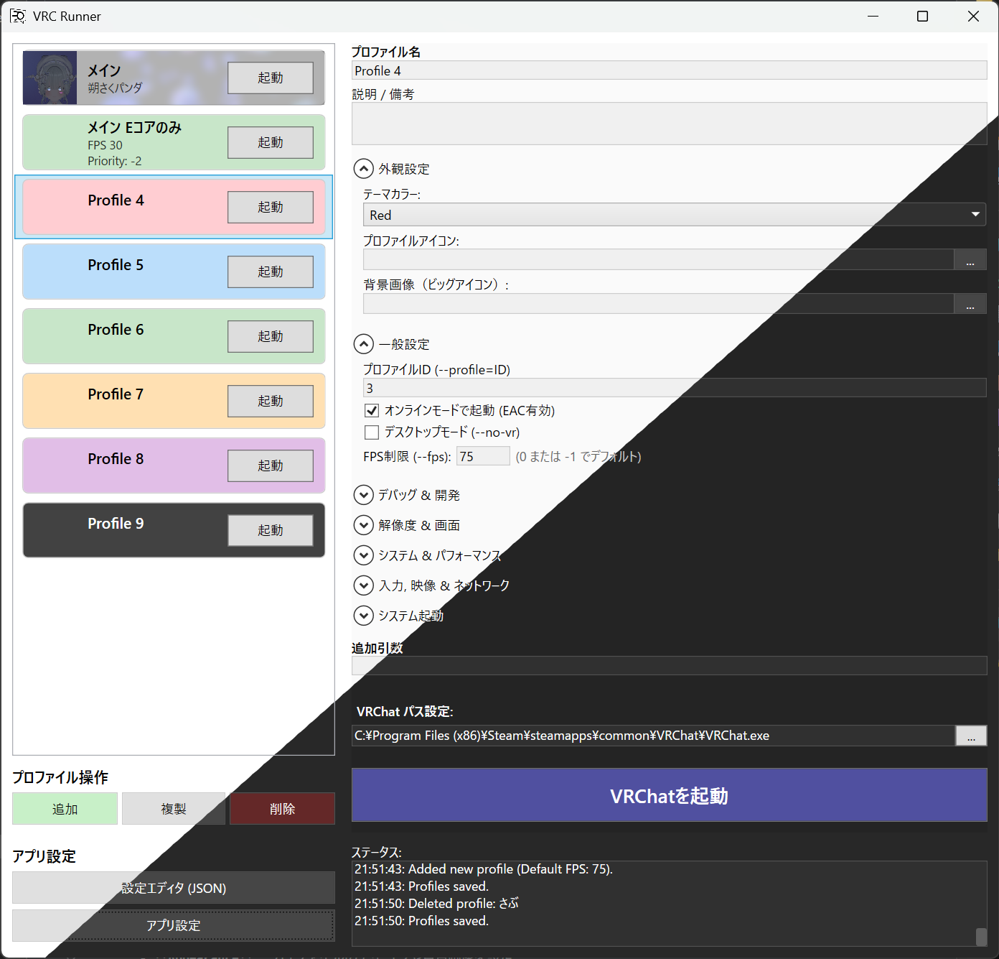
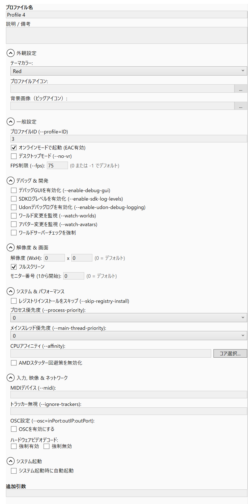

# VRC Runner

  

**VRC Runner** は、VRChat の起動プロファイルを快適に管理・自動化するための多機能ランチャーツールです。
複数のアカウントや起動オプション（解像度、モニター設定、OSCポートなど）を「プロファイル」として保存し、ワンクリックで切り替えて起動することができます。

## 主な機能

### 起動管理
- **複数プロファイル**: デスクトップモード、VRモード、サブアカウントなどの設定を個別に保存
- **詳細な起動引数**: 解像度、フルスクリーン設定、モニター番号、FPS制限などの起動引数をGUIで簡単に設定
- **自動起動**: システム起動時に指定したプロファイルを自動的に立ち上げることが可能（ネットワーク待機機能付き）

### システム最適化
- **CPU Affinity**: VRChat プロセスで使用するCPUコア（Pコア/Eコア）を自動的に割り当て、パフォーマンスを最適化
- **OSC管理**: プロファイルごとにOSC送受信ポートを管理。OSCのリセット機能も搭載

### UI / UX
- **ダークテーマ対応**: 目に優しいダークモードを標準搭載（システム設定に追従または手動切り替え）
- **日本語 / 英語 対応**: アプリケーション言語を簡単に切り替え可能
- **バックグラウンド画像**: プロファイルごとに好みの画像を背景として設定でき、視認性を向上

## スクリーンショット

| メインウィンドウ | 設定エディタ |
| --- | --- |
|  |  |
| プロファイル管理と起動オプション | キャッシュや制限設定の調整 |

## インストール方法

1. **ダウンロード**: [Releases](https://github.com/lighfu/VRC_Runner/releases) ページから最新のバージョンをダウンロードしてください。
    - `..._Standalone_...`: .NET ランタイム不要で動作します（ファイルサイズ大）。
    - `..._Net8_...`: 実行には [.NET 8 Desktop Runtime](https://dotnet.microsoft.com/download/dotnet/8.0) が必要です（ファイルサイズ小）。
2. **展開**: ダウンロードしたファイルを任意のフォルダに解凍します。
3. **実行**: `VRC_Runner.exe` を起動します。

> **Note**: アップデートはアプリケーション内から自動的に行うことができます。

## 使い方

1. **プロファイルの作成**: 左下の「追加」ボタンを押して新規プロファイルを作成します。
2. **設定**: 右側のパネルで様々な設定ができます。
    - **Appearance**: プロファイルのアイコンや背景画像を設定。
    - **Launch Options**: 起動モード（VR/Desktop）や引数を追加。
    - **Resolution & Screen**: 解像度や表示モニターを指定（※ 現在は機能しません。）
3. **起動**: プロファイルを選択し、リスト内の「Launch」ボタンを押すと VRChat が起動します。

## ⚖️ ライセンス

© 2026 紫陽花広場 / 朔さくパンダ
This project is licensed under the MIT License - see the [LICENSE](LICENSE) file for details.
